# Schulich UAV — My Experience & Progression

## Overview

Schulich UAV (SUAV) is a multidisciplinary team that designs and builds autonomous unmanned aerial systems for international competition.

I joined in 2022 as a software team member and progressed to:

- Software Lead (2023–2024)  
- Avionics Lead & Vice President (2024–2025)  
- President & Head of Engineering (2025–2026)  

During this time, I helped rebuild the team post-COVID, architect a full autonomous UAV software stack, and scale the team to over 70 members.

## What is Schulich UAV?

Schulich UAV is a multidisciplinary aerospace team building autonomous UAVs for competition. Students across software, electrical, geomatics, mechanical engineering, and business collaborate to develop fully integrated systems.

The goal is to design aircraft capable of executing autonomous missions by combining flight control, computer vision, navigation, and payload delivery. This requires strong system integration and validation through real-world flight testing.

As a competition team, the commitment is significant, requiring consistent involvement across design, development, and testing alongside a full academic workload.

## My Progression and Experiences

### **2022–2023** — Hammerhead  
*Software Member*

This was my first year on the team, joining during a post-COVID rebuild with ~15 members and no fully integrated aircraft. The team faced a significant knowledge gap, and much of the effort focused on re-establishing a working baseline system.

At the time, development was heavily constrained by ongoing mechanical and electrical integration challenges, resulting in an incomplete software stack. The primary goal shifted toward achieving a minimum viable aircraft capable of stable manual flight following several crashes.

My role this year was primarily focused on building foundational skills:
- Learning ArduPilot and Mission Planner  
- Gaining exposure to UAV system architecture  
- Developing early ground control station (GCS) functionality through web development  

While I did not contribute heavily to final system performance, this was a critical development year that established my understanding of autonomous UAV systems.

  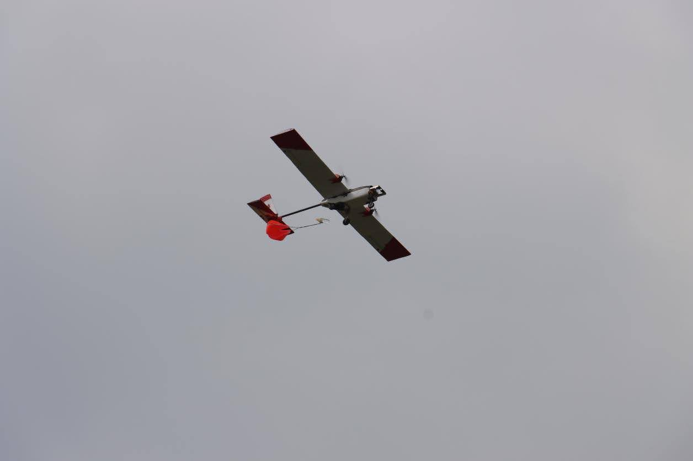
   
  <b>Figure 1.</b> Hammerhead aircraft during early flight testing.

The system was not capable of autonomous flight or mission execution at this stage, largely due to instability and integration gaps. Multiple crashes reinforced the need to prioritize reliability before autonomy.

  
   
  <b>Figure 2.</b> Hammerhead following a crash caused by a landing gear failure.

During this time, I also began working with ground control systems to support basic flight monitoring and command.

  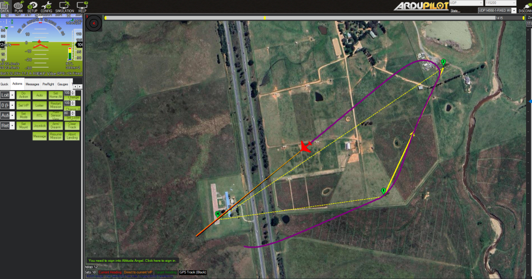
   
  <b>Figure 3.</b> Early use of ground control systems for telemetry and flight operations.

---

### **2023–2024** — Zenith  
*Software Lead*

This was a major step up as I became Software Lead following the graduation of nearly the entire previous team, leaving only two returning members. With limited prior experience and no existing system to build on, I was responsible for recruiting a new team while independently designing and implementing the software stack.

  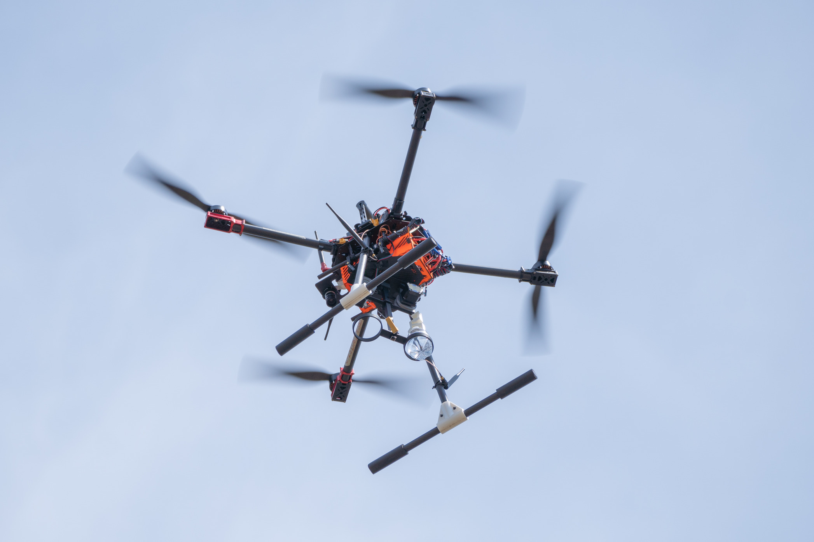
   
  <b>Figure 4.</b> Zenith, Schulich UAV’s first quadcopter.

I developed Schulich UAV’s first fully integrated software system, spanning:
- Low-level flight control and autonomous orchestration  
- Computer vision using YOLOv8 to detect targets (shapes, letters, colours)  
- Embedded control for payload and sensor systems (stepper motor payload deployment, camera triggering)  
- Direct georeferencing to estimate target coordinates  
- A custom ground control station (HTML/CSS/JS) for telemetry, CV visualization, and flight control  

The system enabled real-time target detection and localization to support autonomous payload delivery.

  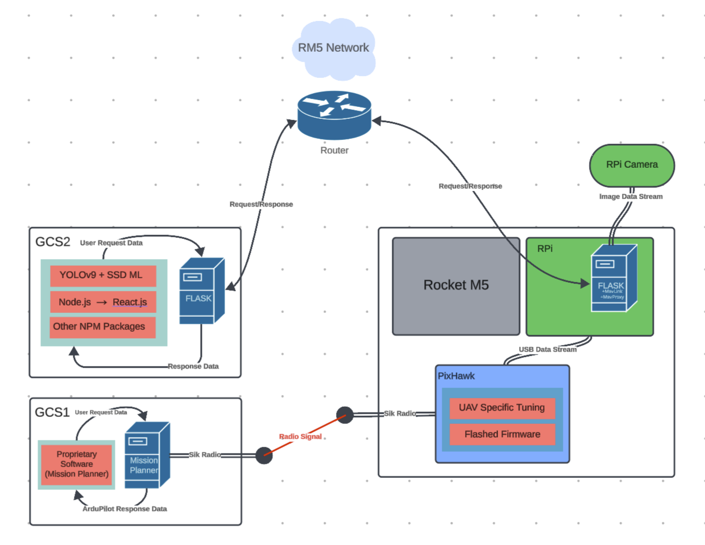
   
  <b>Figure 5.</b> First software architecture, designed for simplicity and a working MVP.

  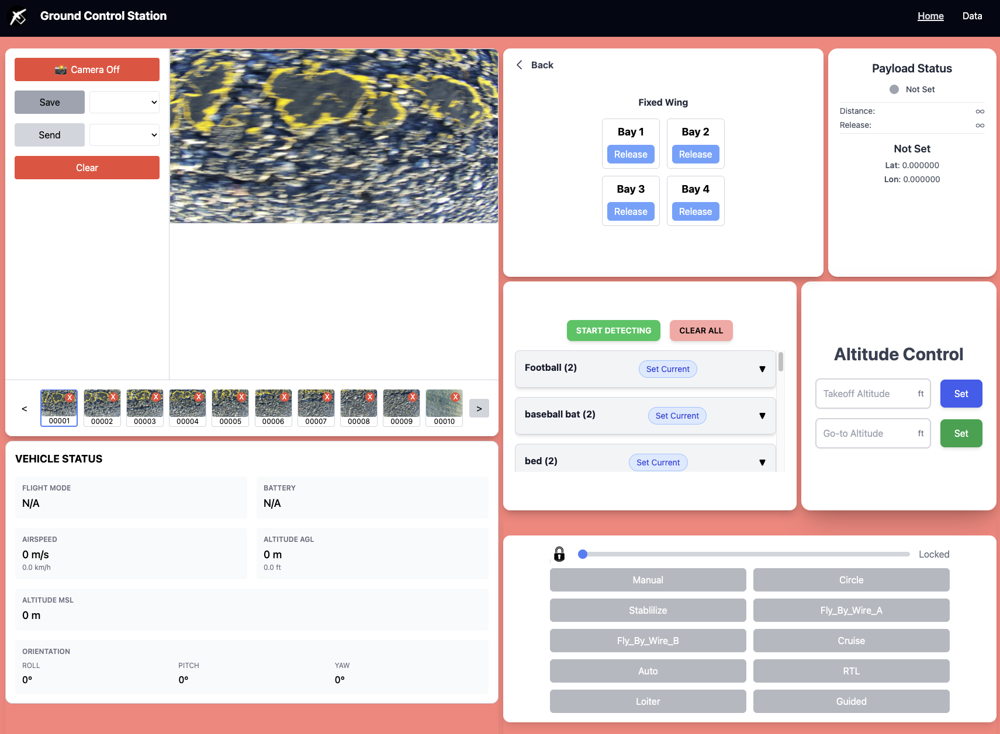
   
  <b>Figure 6.</b> Schulich UAV's first GCS with control over payload bays, flight information, flight mode control, and imaging control.

The most challenging areas were control systems and networking. With no prior experience, I learned both through documentation, source code, and experimentation.

On the networking side, I selected a RocketM5 radio to provide high-bandwidth, reliable communication without cellular dependency (critical for remote competition environments). This enabled SSH access over a local network, allowing the ground station to trigger operations via API requests (image capture, geodata transmission, payload deployment).

  
  
   
  <b>Figure 7.</b> RocketM5 radio link enabling high-bandwidth communication between ground station and aircraft.

To ensure safety and reliability, I validated flight logic in simulation before deployment.

  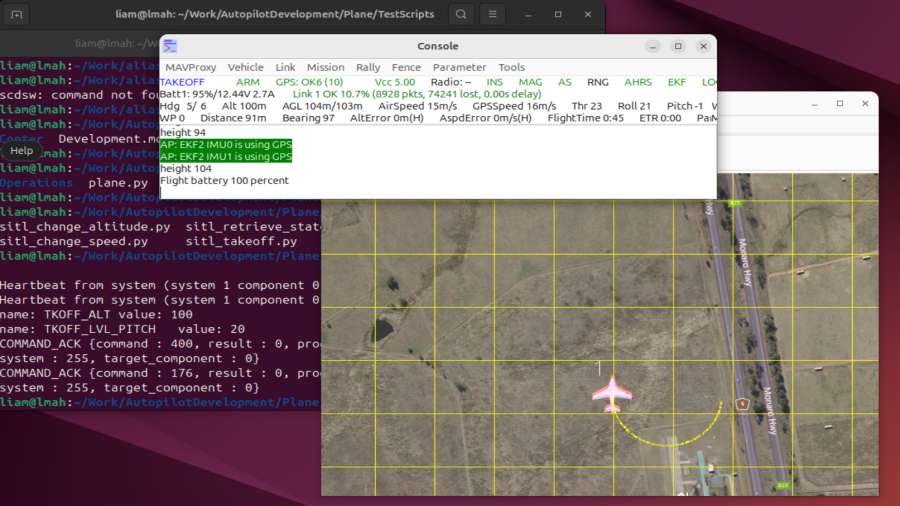
   
  <b>Figure 8.</b> SITL and Gazebo simulations used to validate flight code.

On the control side, I debugged instability in a ~10 kg quadcopter, eventually identifying poorly tuned PID parameters in ArduPilot. This required working from low-level flight behavior up to controller tuning, building my understanding of control systems from scratch.

  
   
  <b>Figure 9.</b> Early instability caused by improperly tuned PID parameters.

This year reinforced the importance of systems engineering. While individual components like neural networks are manageable in isolation, integrating them under real-world constraints (latency, motion, altitude variation, and precision) proved significantly more complex.

  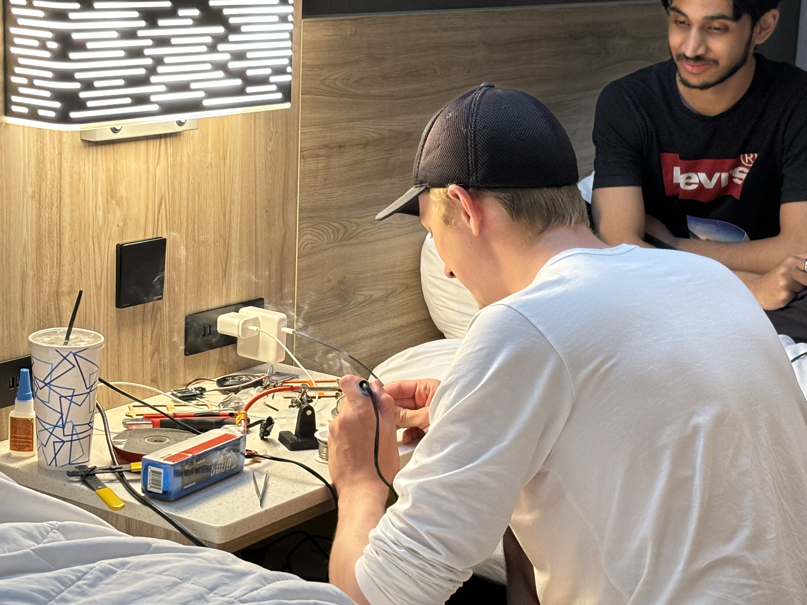
   
  <b>Figure 10.</b> Pre-competition debugging and hardware recovery efforts.

We deployed this system at SUAS 2024, placing **1st among Canadian teams** and in the **top third overall**. This marked my first experience leading a technical team in a real engineering environment.

  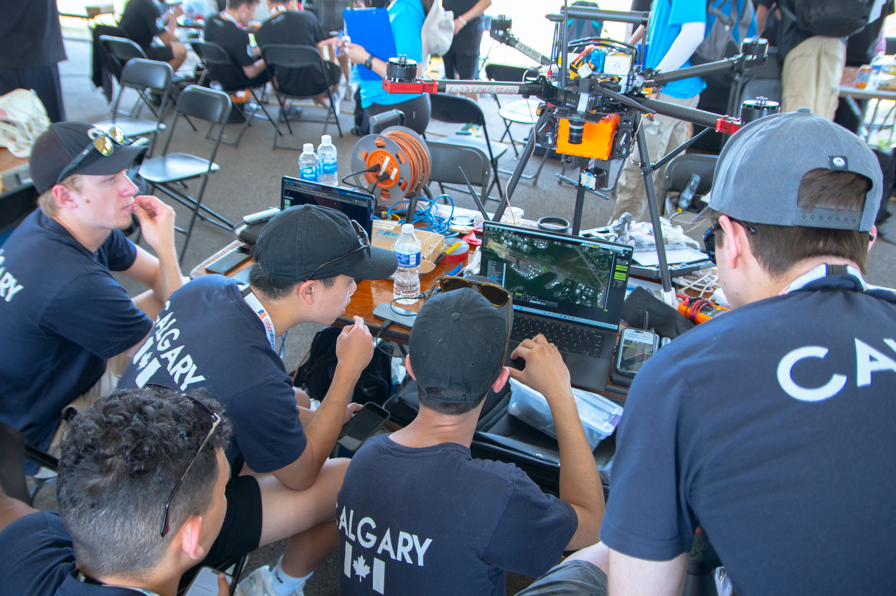
   
  <b>Figure 11.</b> SUAS 2023 competition in Maryland.

---

### **2024–2025** — Orca  
*Avionics Lead (Electrical, Software, Geomatics, Systems Engineering) & Vice President*

This year, I served as the lead and most senior engineer across software, electrical, geomatics, and systems engineering, leading a team of ~40 students. I was responsible for all non-mechanical engineering and held final accountability for system-level decisions and flight safety.

At the same time, I was completing an internship at Lockheed Martin Skunk Works, often balancing full workdays with continued development on SUAV. This year required a significant step up in both technical depth and leadership.

  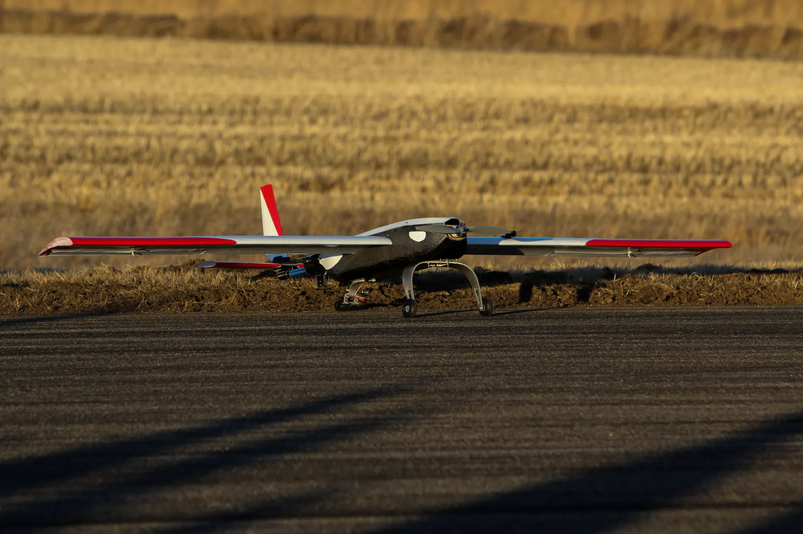
   
  <b>Figure 12.</b> Orca on maiden flight day.

This year, the team transitioned back to a fully custom fixed-wing platform. This was a challenging shift given limited prior success and knowledge transfer in fixed-wing systems.

A major focus for me was strengthening our **electrical architecture**, requiring me to rapidly deepen my understanding beyond software in order to effectively lead cross-disciplinary work.

  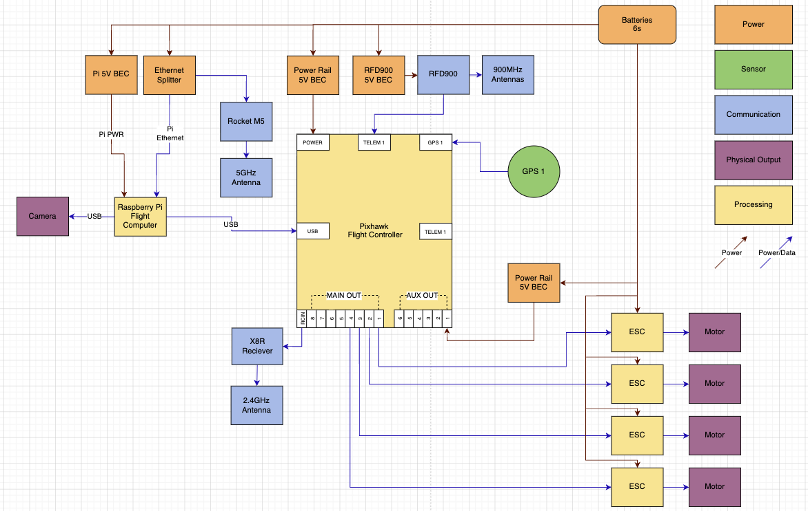
   
  <b>Figure 13.</b> Electrical architecture developed in collaboration with the electrical team.

#### Key Engineering Challenges

**1. Direct Georeferencing (Fixed-Wing)**  
Estimating target coordinates from aerial imagery proved significantly more difficult on a fixed-wing platform. Synchronization errors between GPS data and image capture compounded rapidly at higher speeds and altitudes, requiring careful handling of timing and system accuracy.

**2. Payload Accuracy**  
Achieving precise payload drops from a moving fixed-wing aircraft required accounting for wind, velocity, and cumulative system error. We implemented autonomous missions that placed pre-drop waypoints to stabilize the aircraft before release.

**3. Setup Time Reduction**  
Previous setup times exceeded multiple hours. By improving preflight preparation and deepening understanding of ArduPilot internals (sensor fusion with Extended Kalman Filters, failsafes, preflight checks), we reduced setup time to under 30 minutes.

**4. Team Scaling & Knowledge Transfer**  
Leading a large team required balancing trust, oversight, and mentorship. I needed to ensure that team members had the opportunity to independently contribute to flight critical systems while also maintaining safety and quality in a high-risk aircraft.

  
   
  <b>Figure 14.</b> Internal wiring improvements, reducing setup complexity and error. Sped up setup times by ~433%.

#### Systems Debugging & Reliability

A recurring challenge was debugging issues that spanned multiple subsystems.

One example involved control surface instability that was only reproducible by arming the aircraft in a semi-autonomous mode at low airspeeds. After calling off a flyday, I brought the aircraft home and set it up in my living room to debug the system end-to-end to isolate the issue.

  
   
  <b>Figure 15.</b> Debugging control instability caused by airspeed-related PID scaling.

As flight range increased, our previous telemetry system became insufficient. I upgraded the communication link by moving from 6 dBi omnidirectional to 15 dBi directional antennas, achieving a ~300% range increase.

  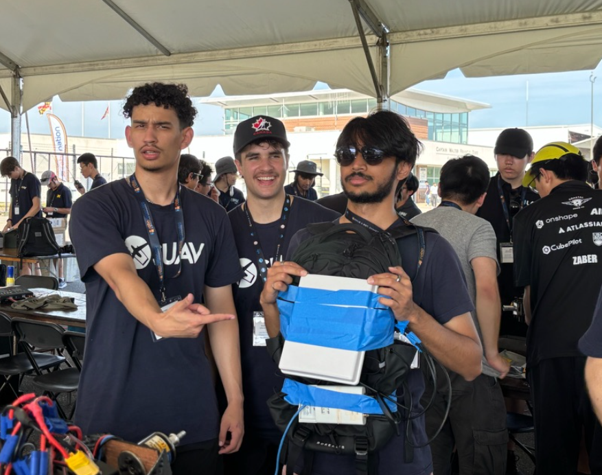
   
  <b>Figure 16.</b> Directional antenna setup (my masterpiece) used to continuously point the antenna towards the aircraft to maintain a stable telemetry link during long-range flight.

#### Outcome

This was the first time Schulich UAV successfully developed an autonomous fixed-wing aircraft, marking a major milestone for the team.

We qualified for SUAS 2025 and placed:
- **1st / 81 teams — Technical Design Deliverables**

This remains one of the accomplishments I am most proud of.

  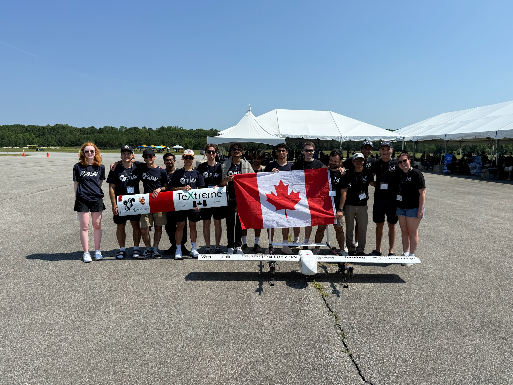
   
  <b>Figure 17.</b> SUAS competition team photo with McGill.

Check out the competition recap:  
https://www.youtube.com/watch?v=ACizj0ecJ4E&t

---

### **2025–2026** — Mako  
*Team Captain, President & Head of Engineering*

This year is still ongoing. My primary focus has been enabling the team to operate effectively by managing logistics such as travel, funding, onboarding, and coordination, allowing engineers to focus on technical work.

As President and Head of Engineering, I oversee all engineering efforts across the team. My role is largely centered on project management, using Agile methodologies to ensure consistent progress and timely delivery. I closely monitor both technical and scheduling risks to support safe and successful system development.

With the team growing to over 70 members, I rely heavily on strong mechanical and avionics leads to drive day-to-day engineering work. While I am less involved in low-level implementation, I maintain final decision-making authority on critical engineering choices and step in to support complex technical challenges when needed.

Although final competition results are not yet known, we achieved our first successful fixed-wing maiden flight in years without a crash. This represents a major milestone in the team’s development and reflects increased system maturity and reliability. I hope this progress gives the team the confidence to pursue more ambitious platforms, such as VTOL systems, in future years.

  
   
  <b>Figure 18.</b> Schulich UAV 2025–2026 team.

  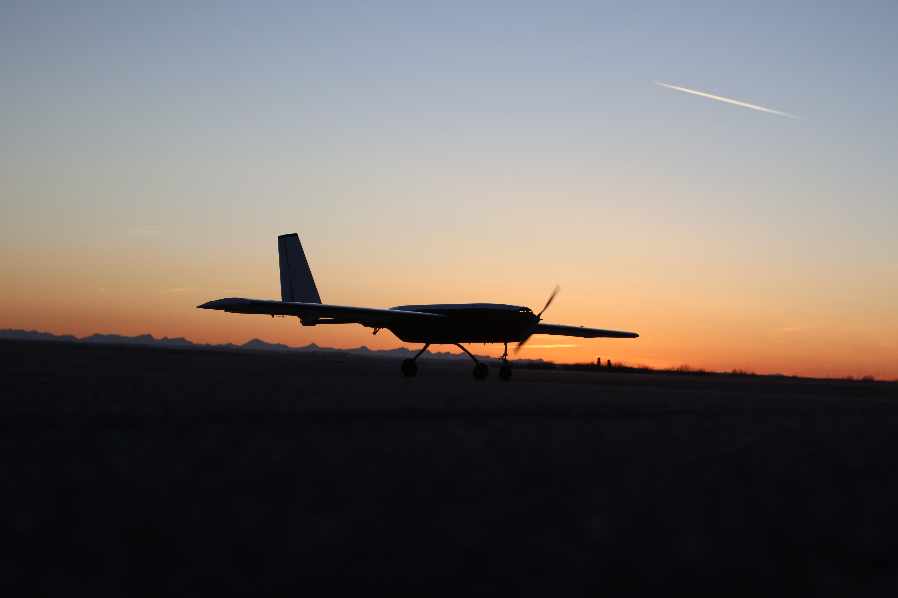
   
  <b>Figure 19.</b> Mako fixed-wing aircraft.

  
   
  <b>Figure 20.</b> Taxi testing prior to maiden flight.

  
   
  <b>Figure 21.</b> Using Lockheed Martin Skunk Works GCS software (VCSi) during operations.

  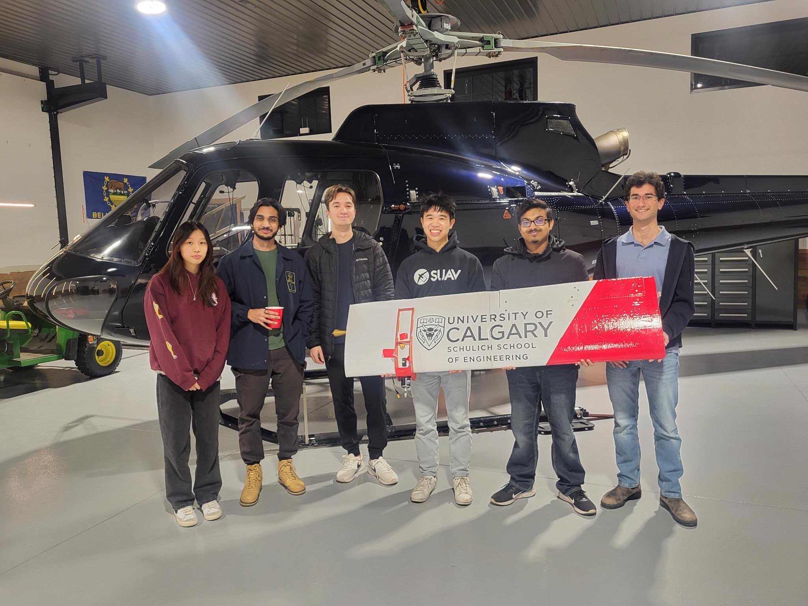
   
  <b>Figure 22.</b> Presenting to Airdrie Flying Club, who provide flight operations support.

## Conclusion

### Why I Wrote This

I wrote this as a reflection on my time at Schulich UAV as I approach graduation. The team defined my university experience, and I invested thousands of hours into its growth and success.

This README serves as both a personal record of what I built and contributed, and a way to communicate the depth and impact of that experience on my personal development.

---

### Final Note

I’m incredibly grateful for what Schulich UAV has provided. It led directly to my first industry experience at Schlumberger and later at Lockheed Martin Skunk Works.

More importantly, it introduced me to some of the most driven and capable people I know. People who share the same passion for engineering real, impactful systems.